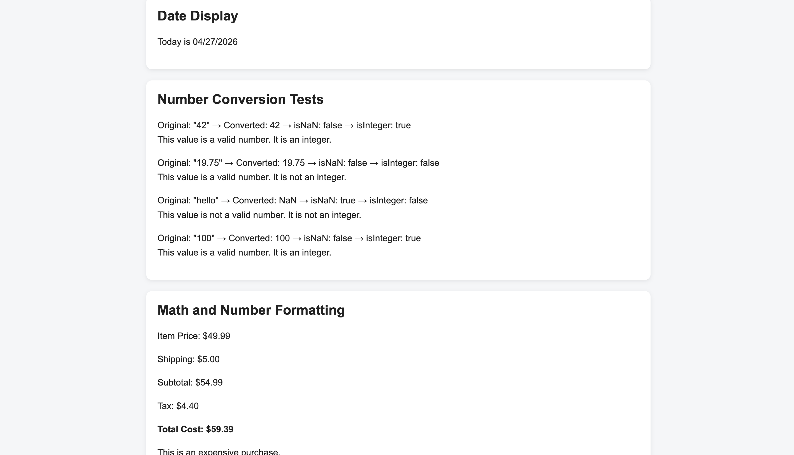

# comp484-hw9
# JavaScript Mini Demo

## Overview

This project demonstrates the use of JavaScript in the browser, focusing on built-in objects such as the `Date` and `Number` objects. The webpage includes three main sections: displaying the current date, converting and validating numbers, and performing math calculations with formatted output.

## Built-in Objects and Methods Used

### Date Object
- `new Date()`
- `getMonth()`
- `getDate()`
- `getFullYear()`

### Number Object
- `Number()`
- `Number.isNaN()`
- `Number.isInteger()`

### Number Formatting
- `toFixed()`

### DOM Manipulation
- `document.getElementById()`
- `.textContent`
- `.innerHTML`

## Screenshot

## Reflection

The easiest part of this assignment was displaying the current date using the Date object. Once I understood how to extract the month, day, and year, formatting it into the required format was straightforward. The most challenging part was working with number conversion and making sure I correctly used Number.isNaN() and Number.isInteger() for each value.

I learned that the Date object requires adjusting the month because it is zero-based, and that formatting is important for displaying clean and readable output. From the Number object, I learned how to convert string values into numbers and check whether they are valid numbers or integers. I also learned how to display results directly on the webpage using JavaScript and the DOM instead of only printing to the console.

## Live Demo (GitHub Pages)

